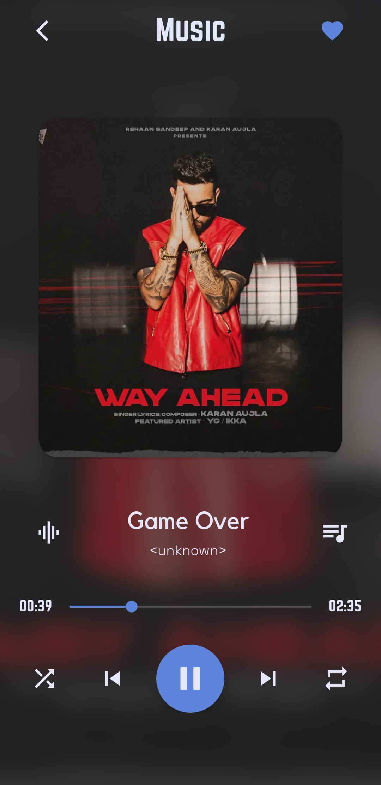
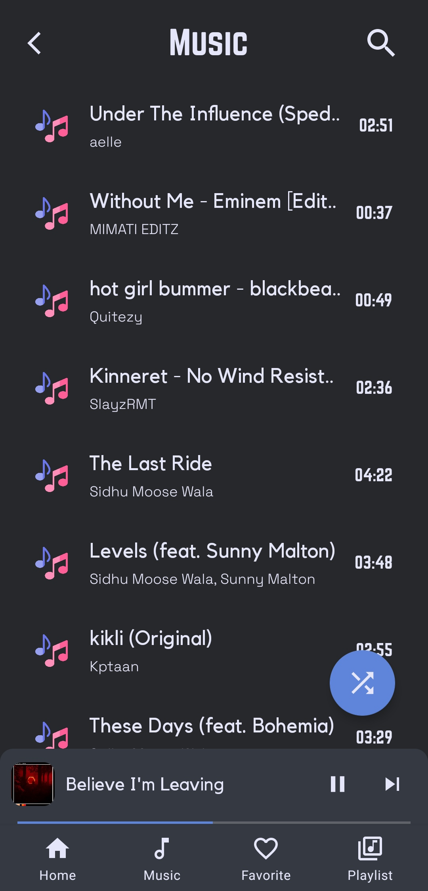
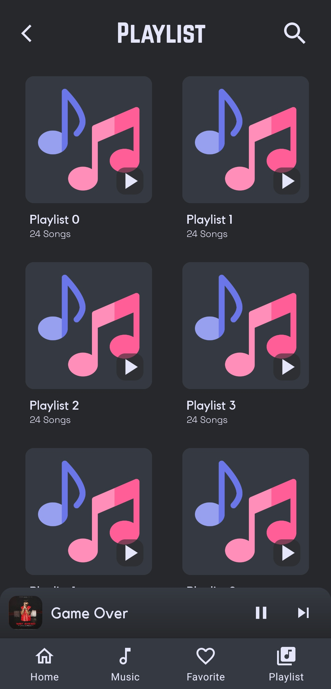
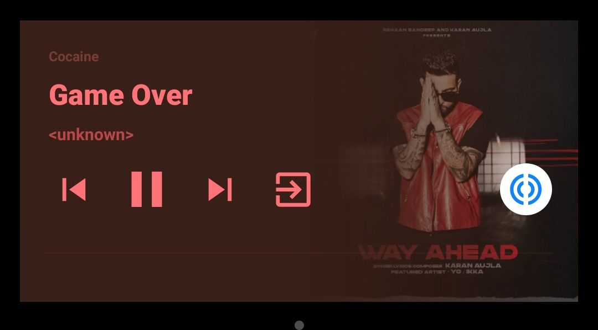

# Cocaine

Cocaine is A Music Player App made in Kotlin Language.

	
	
	

## Screeshots :

|  |  |
|:---:|:---:|
| Player UI | Music List UI |

|  |  |
|:---:|:---:|
| Playlist UI | Notification |

## Features

 - Play songs from Local Storage
 - Fetch all songs automatically
 - Shuffle songs
 - Add Favorite Songs
 - Playlist

## More projects :

 - [Virtual Assistant](https://github.com/vishal2376/virtual-assistant)
 - [C++ Mini Projects](https://github.com/vishal2376/cpp-mini-projects)
 - [Telegram Bot](https://github.com/vishal2376/telegram-bot)

## Contacts :

 - [Instagram](https://www.instagram.com/vishal_2376/)
 - [Telegram](https://t.me/vishal2376/)
 - [Join Telegram group](https://t.me/cppwithtricks)
